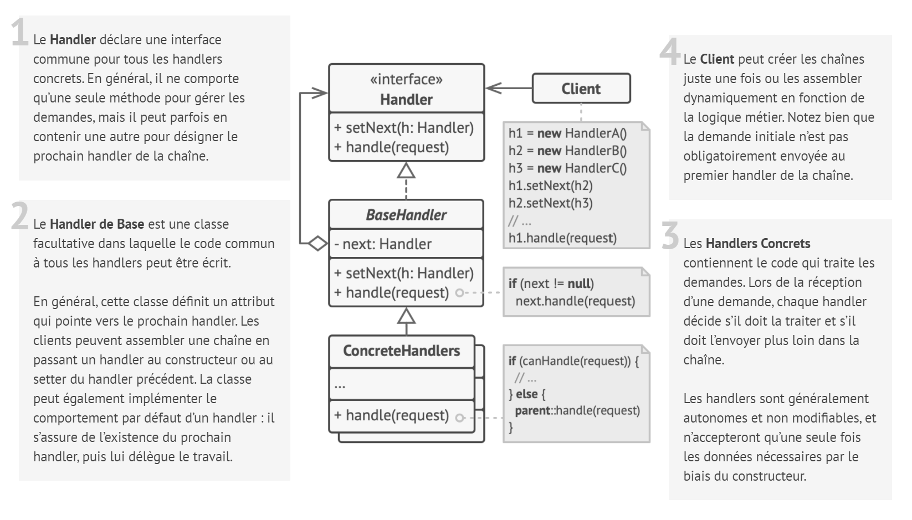
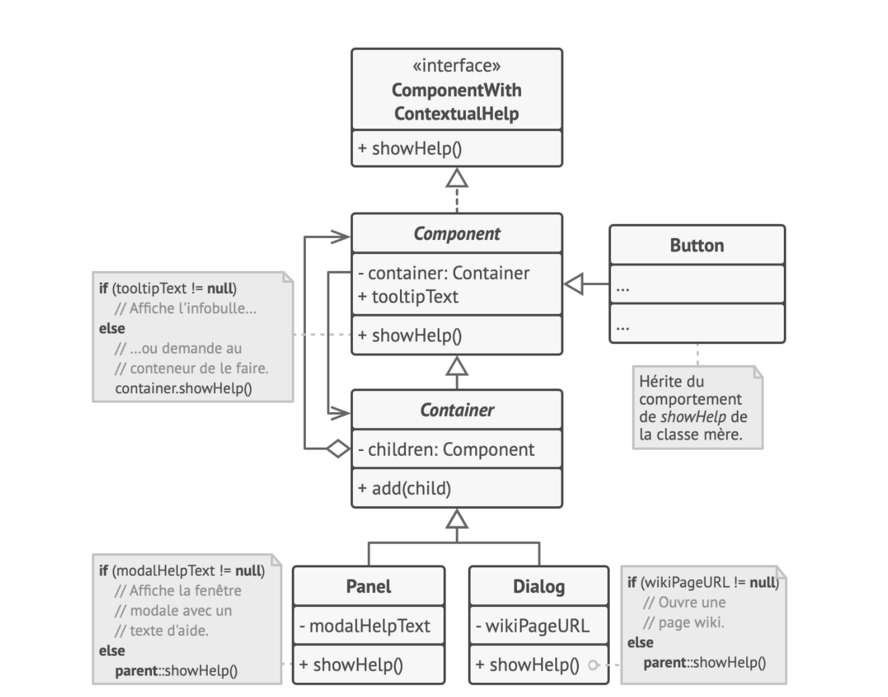

# Chaîne de responsabilité

## Intention

**Chaîne de responsabilité** est un patron de conception comportemental qui permet de faire circuler des demandes dans
une chaîne de handlers. Lorsqu’un handler reçoit une demande, il décide de la traiter ou de l’envoyer au handler suivant
de la chaîne.

## Structure

## Structure particulière

Dans cet exemple, la **Chaîne de responsabilité** est chargée d’afficher l’aide contextuelle pour les éléments actifs de
la GUI.

