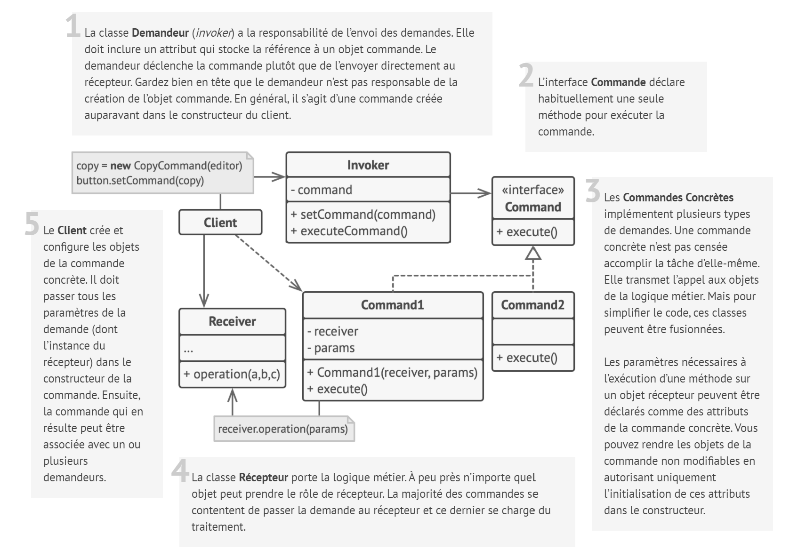
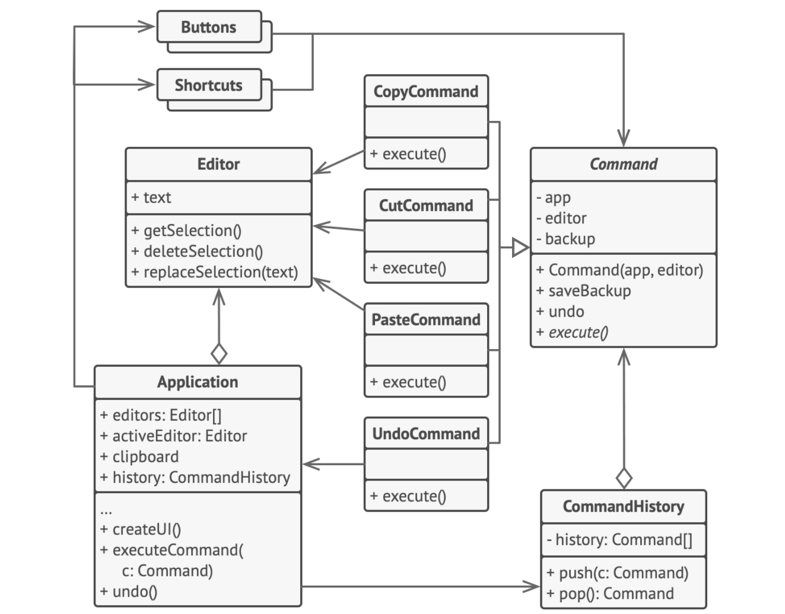

# Commande

## Intention

**Commande** est un patron de conception comportemental qui prend une action à effectuer et la transforme en un objet
autonome qui contient tous les détails de cette action. Cette transformation permet de paramétrer des méthodes avec
différentes actions, planifier leur exécution, les mettre dans une file d’attente ou d’annuler des opérations
effectuées.

## Structure

## Structure particulière

Dans cet exemple, le patron de conception **Commande** aide à tracer l’historique des traitements et est en mesure
d’annuler les modifications effectuées par un traitement.

