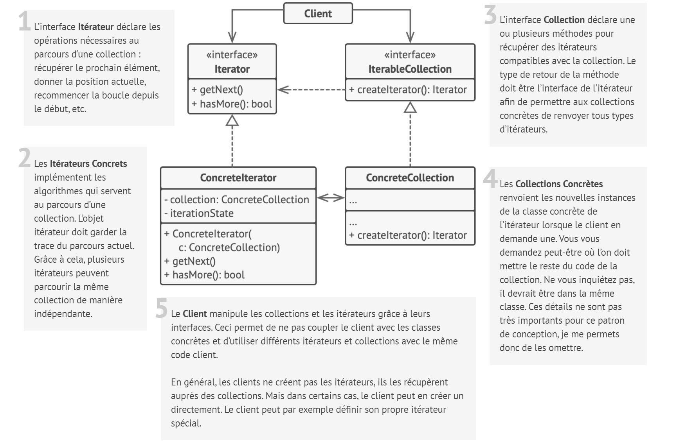
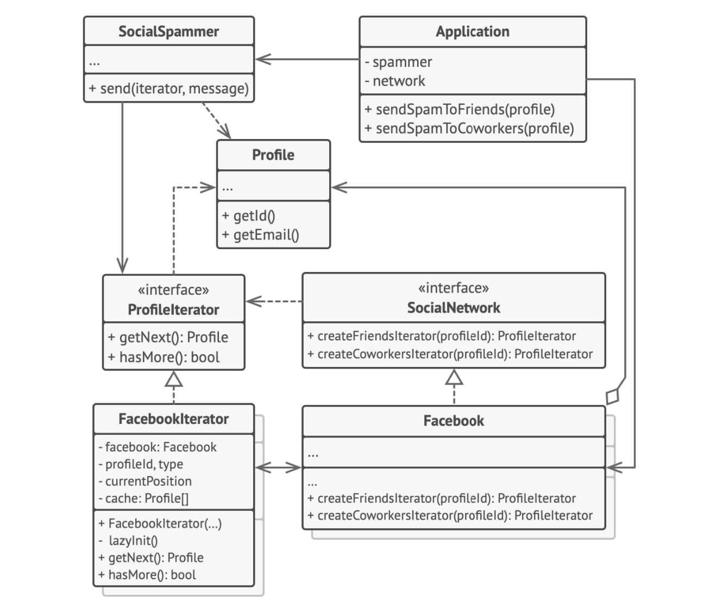

# Itérateur

## Intention

**Itérateur** est un patron de conception comportemental qui permet de parcourir les éléments d’une collection sans
révéler sa représentation interne (liste, pile, arbre, etc.).

## Structure

## Structure particulière

Dans cet exemple, le patron de conception **Itérateur** va servir à parcourir un type spécial de collection qui
encapsule l’accès au graphe social de Facebook. Cette collection procure plusieurs itérateurs qui parcourent les profils
de différentes manières.

