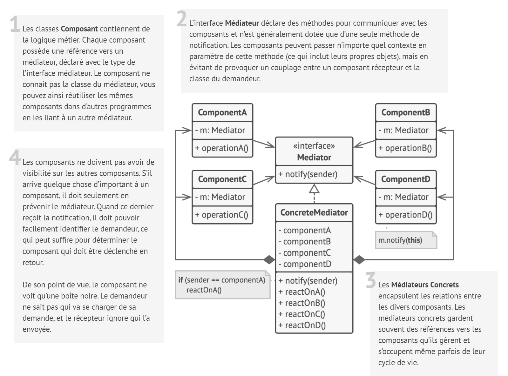
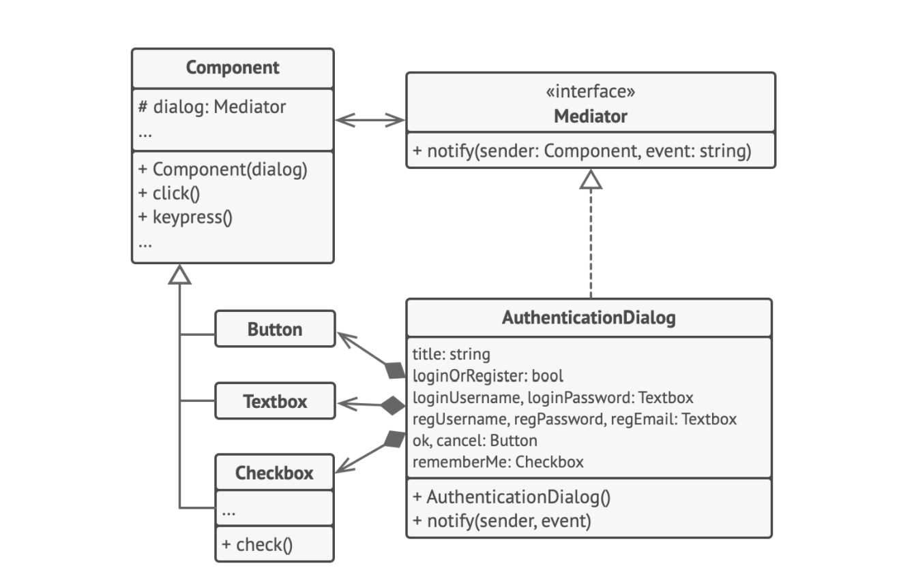

# Médiateur

## Intention

**Médiateur** est un patron de conception comportemental qui diminue les dépendances chaotiques entre les objets. Il
restreint les communications directes entre les objets et les force à collaborer uniquement via un objet médiateur.

## Structure

## Structure particulière

Dans cet exemple, le **Médiateur** vous aide à éliminer les dépendances mutuelles entre différentes classes de l’UI (
boutons, cases à cocher et libellés de texte).

