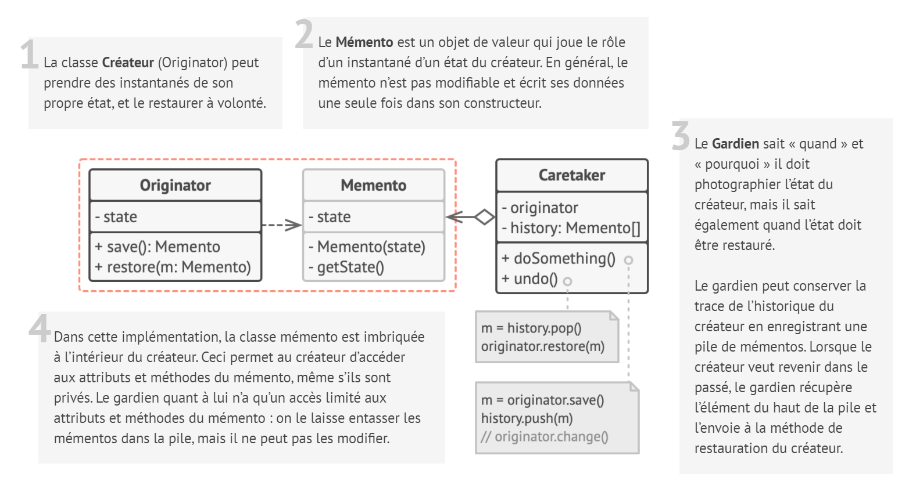
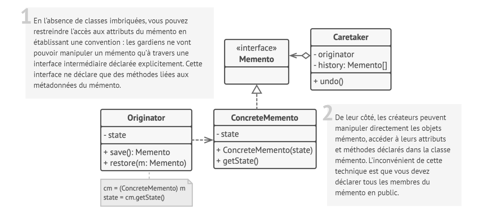
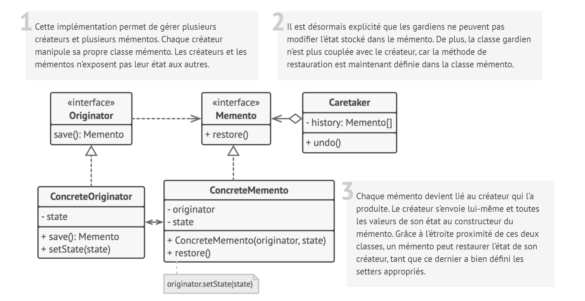
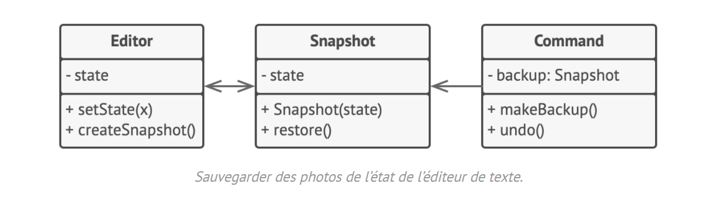

# Mémento

## Intention

**Mémento** est un patron de conception comportemental qui permet de sauvegarder et de rétablir l’état précédent d’un
objet sans révéler les détails de son implémentation.

## Structure

### Implémentation basée sur des classes imbriquées

L’implémentation classique du patron repose sur le principe des classes imbriquées, disponibles dans de nombreux
langages de programmation populaires (comme le C++, C# et Java).

### Implémentation basée sur une interface intermédiaire

Voici une autre possibilité très pratique pour les langages qui ne gèrent pas les classes imbriquées (oui PHP, je te
regarde).

### Implémentation avec une encapsulation encore plus stricte

Si vous ne voulez vraiment pas que les autres classes accèdent au créateur en passant par le mémento, vous pouvez vous y
prendre différemment.

## Structure particulière

Cet exemple utilise le patron **Commande** en plus du mémento pour stocker les photos de l’état de l’éditeur de texte
complexe, et rétablit un état précédent lorsqu’on le lui demande.

