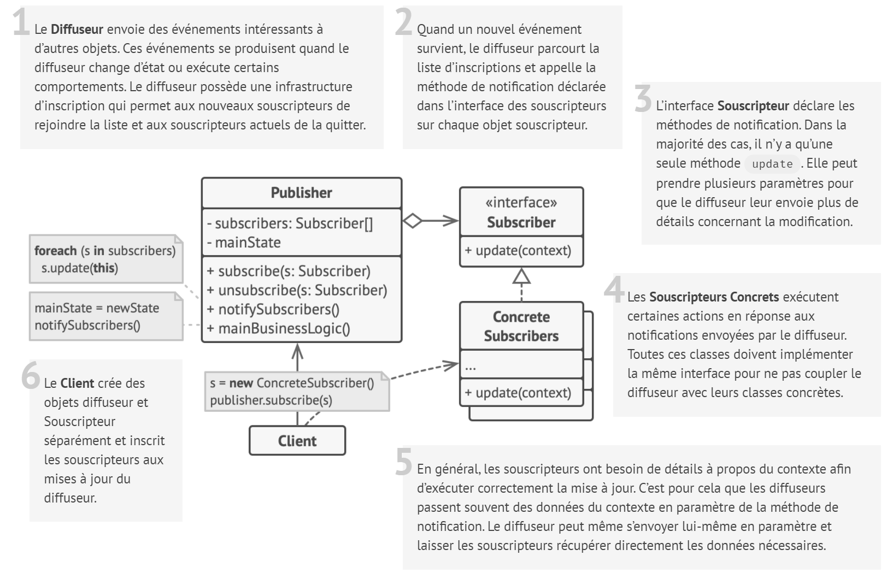
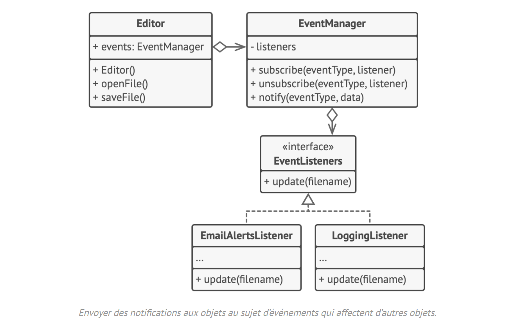

# Observateur

## Intention

L’**Observateur** est un patron de conception comportemental qui permet de mettre en place un mécanisme de souscription pour envoyer des notifications à plusieurs objets, au sujet d’événements concernant les objets qu’ils observent.

## Structure

## Structure particulière

Dans cet exemple, le patron de conception **Observateur** permet à l’objet éditeur de texte d’avertir d’autres objets de
service des changements de son état.

