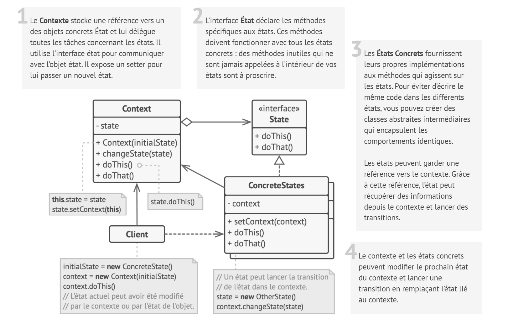
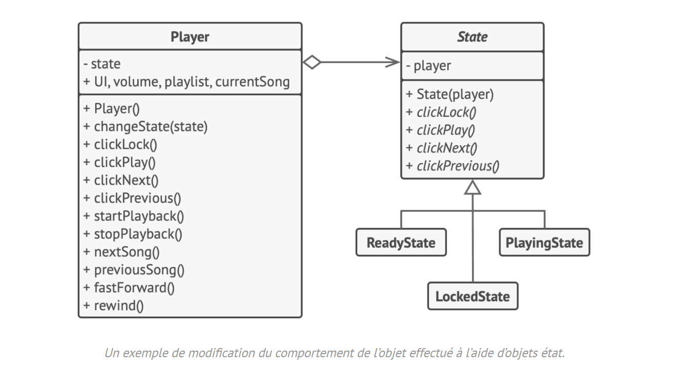

# État

## Intention

**État** est un patron de conception comportemental qui permet de modifier le comportement d’un objet lorsque son état
interne change. L’objet donne l’impression qu’il change de classe.

## Structure

## Structure particulière

Dans cet exemple, le patron de conception **État** permet aux touches du lecteur multimédia d’avoir un comportement
relatif à l’état actuel de la lecture.

