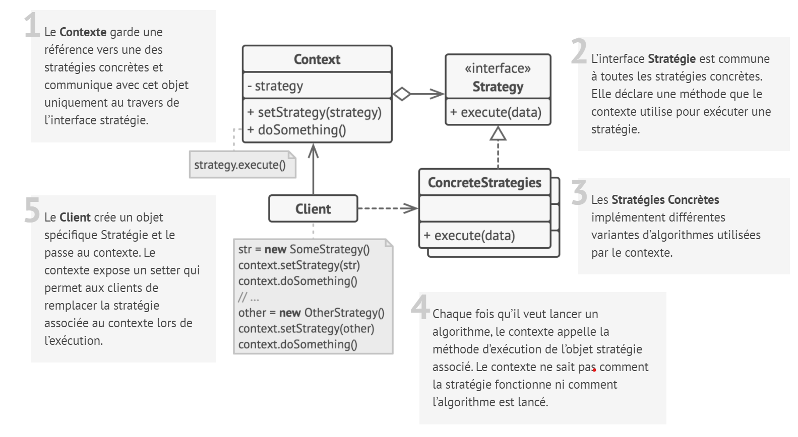

# Stratégie

## Intention

**Stratégie** est un patron de conception comportemental qui permet de définir une famille d’algorithmes, de les mettre
dans des classes séparées et de rendre leurs objets interchangeables.

## Structure

