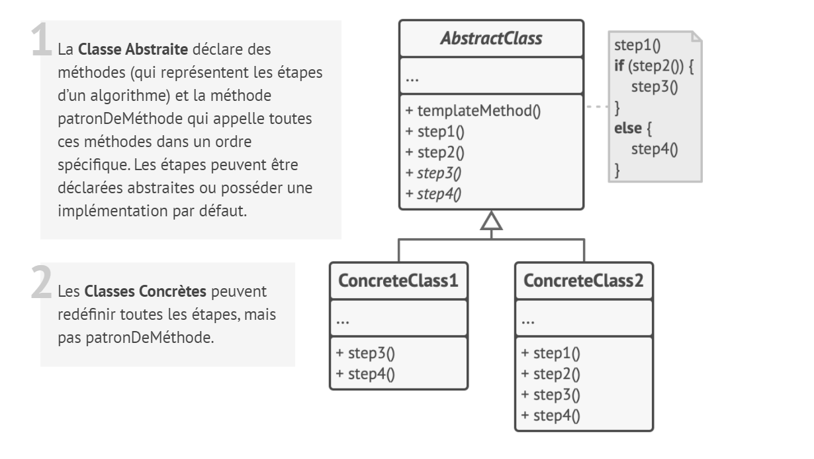
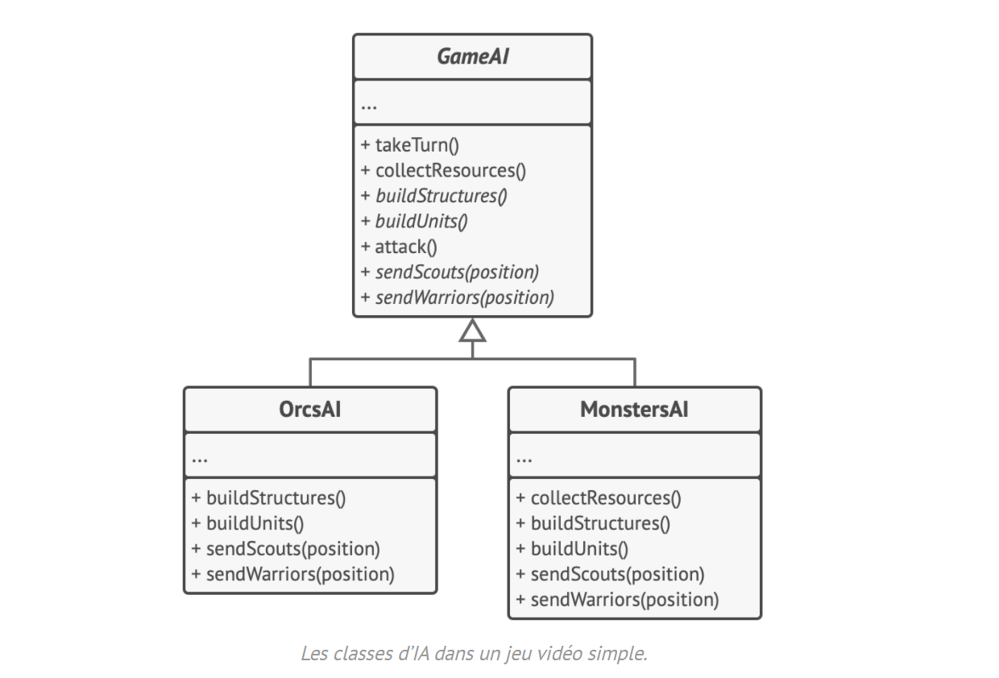

# Patron de méthode

## Intention

**Patron de méthode** est un patron de conception comportemental qui permet de mettre le squelette d’un algorithme dans
la classe mère, mais laisse les sous-classes redéfinir certaines étapes de l’algorithme sans changer sa structure.

## Structure

## Structure particulière

Dans cet exemple, le patron de conception **Patron de Méthode** fournit un squelette pour les branches de l’IA (
intelligence artificielle) d’un jeu vidéo de stratégie simple.

