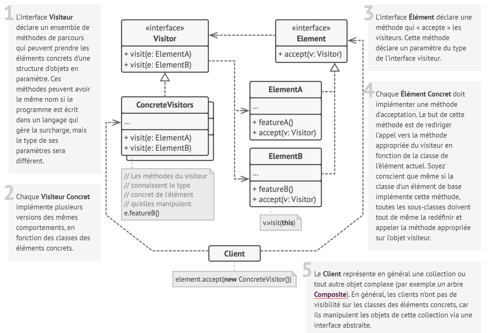
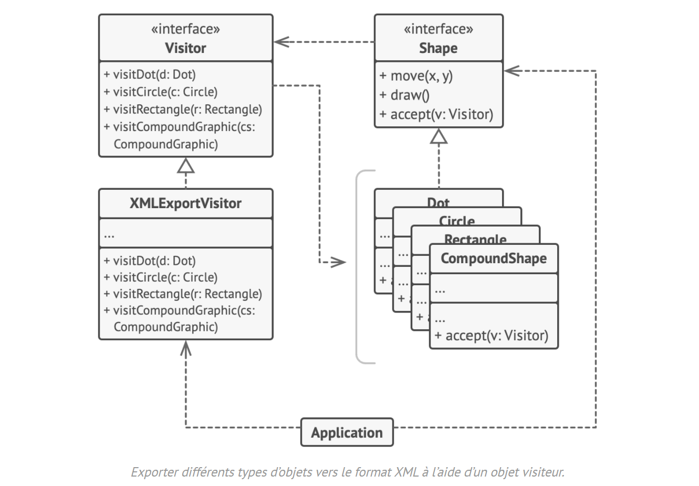

# Visiteur

## Intention

**Visiteur** est un patron de conception comportemental qui vous permet de séparer les algorithmes et les objets sur lesquels ils opèrent.

## Structure

## Structure particulière

Dans cet exemple, le **Visiteur** implémente l’export XML dans la hiérarchie de classes des formes géométriques.

