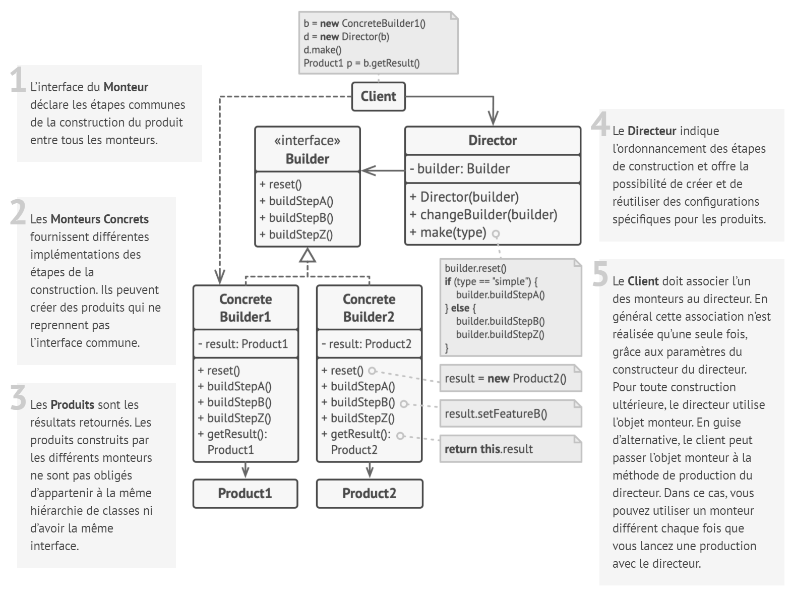

# Monteur

## Intention

**Monteur** est un patron de conception de création qui permet de construire des objets complexes étape par étape. Il
permet de produire différentes variations ou représentations d’un objet en utilisant le même code de construction.

## Structure

