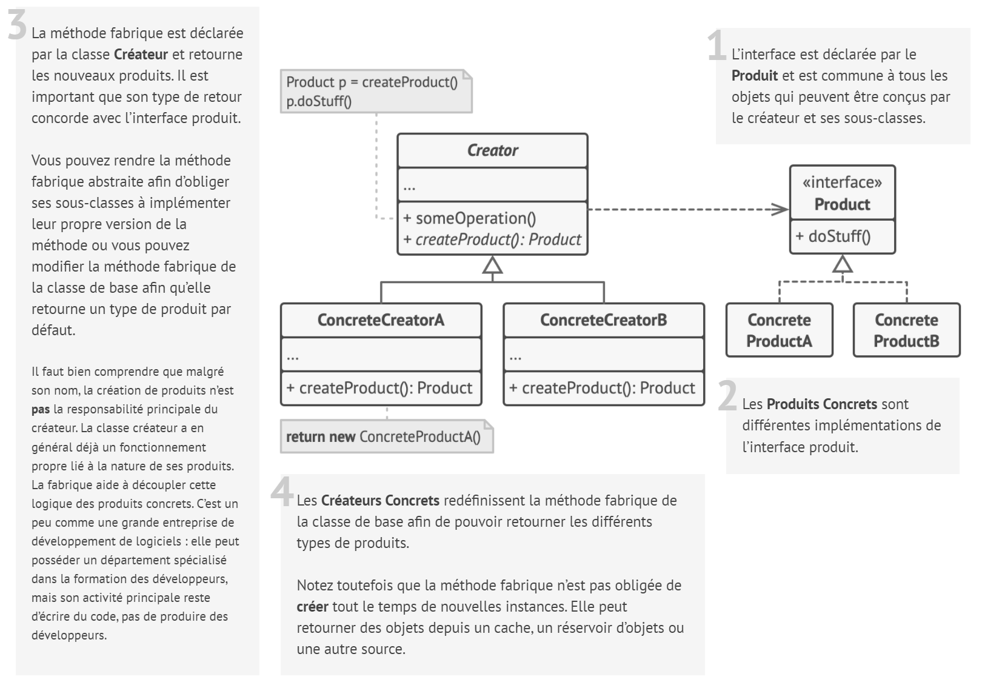

# Fabrique

## Intention

**Fabrique** est un patron de conception de création qui définit une interface pour créer des objets dans une classe
mère, mais délègue le choix des types d’objets à créer aux sous-classes.

## Structure

