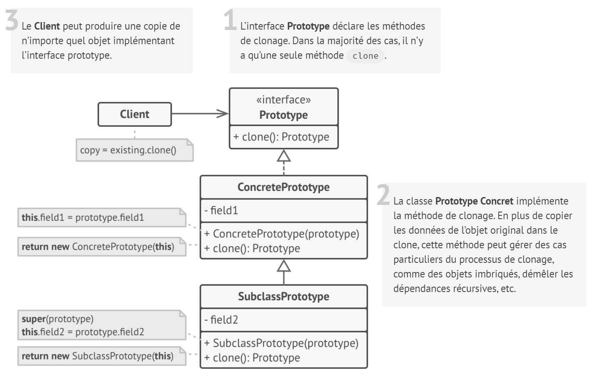
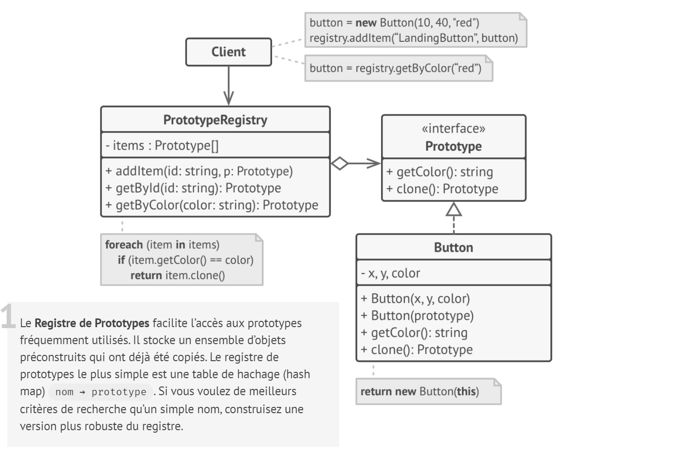

# Prototype

## Intention

**Prototype** est un patron de conception qui crée de nouveaux objets à partir d’objets existants sans rendre le code dépendant de leur classe.
## Structure

### Implémentation de base

### Implémentation du registre de prototypes

