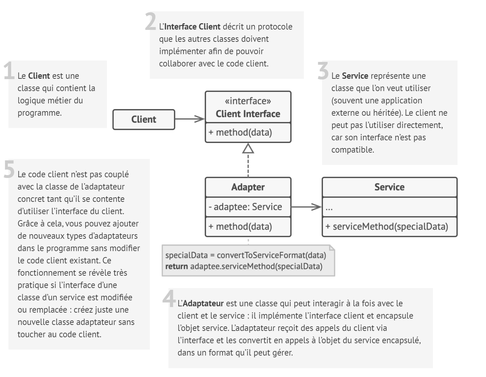
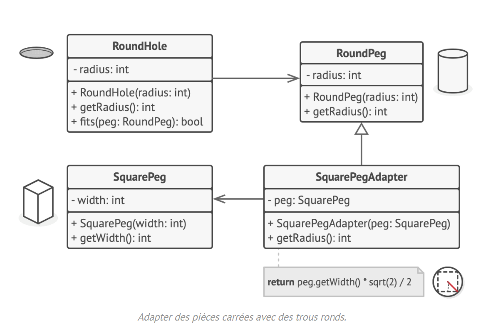

# Adaptateur

## Intention

**Adaptateur** est un patron de conception structurel qui permet de faire collaborer des objets ayant des interfaces
normalement incompatibles.

## Structure

## Structure particulière

Voici un exemple d’utilisation du patron de conception **Adaptateur** qui résout le problème classique de la pièce
carrée à insérer dans le trou rond.

