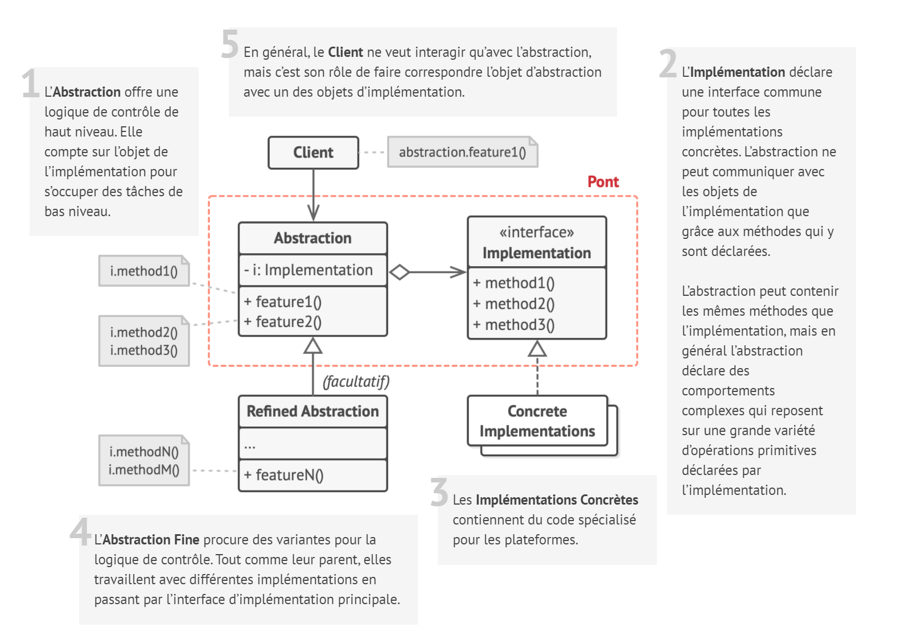
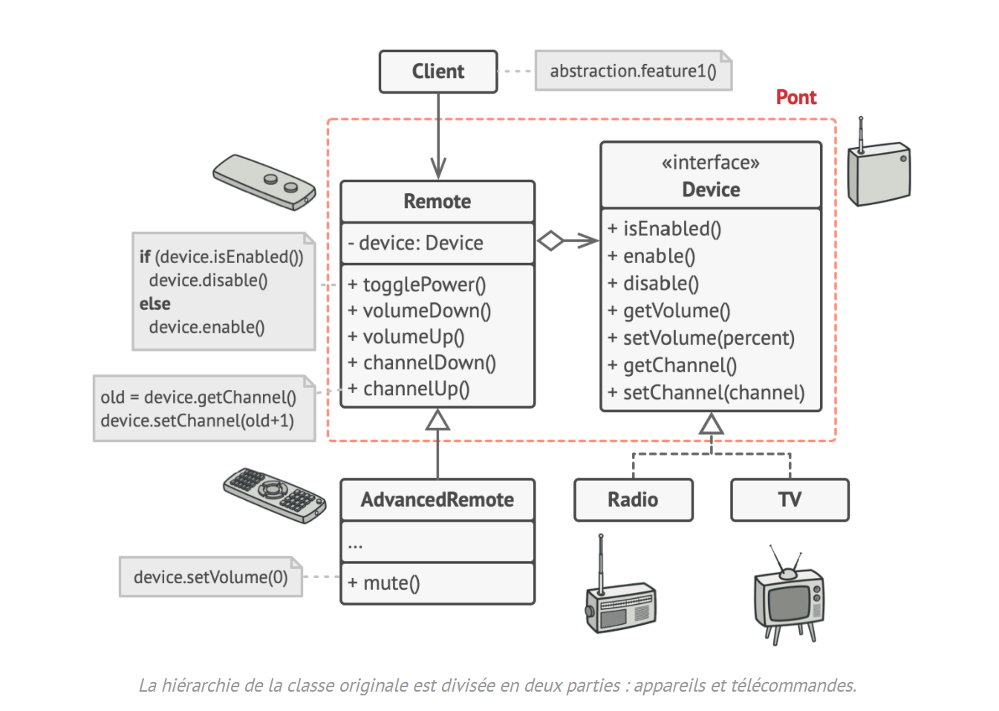

# Pont

## Intention

Le **Pont** est un patron de conception structurel qui permet de séparer une grosse classe ou un ensemble de classes
connexes en deux hiérarchies — abstraction et implémentation — qui peuvent évoluer indépendamment l’une de l’autre.

## Structure

## Structure particulière

Cet exemple montre comment le **Pont** aide à diviser le code monolithique d’une application qui gère les appareils et
leurs télécommandes. Les `Appareils` prennent le rôle de l’implémentation et les `Télécommandes` font office
d’abstraction.

