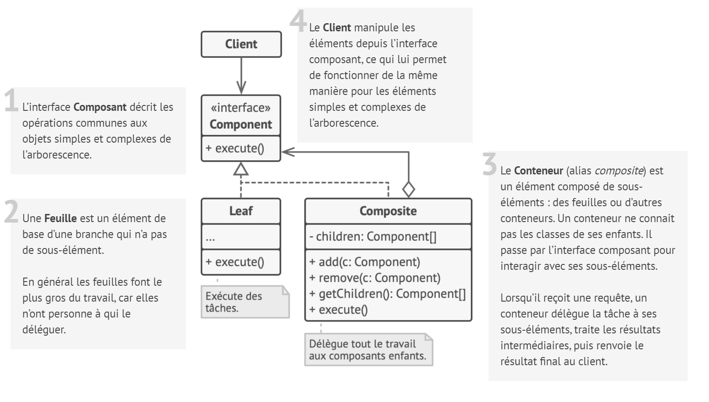
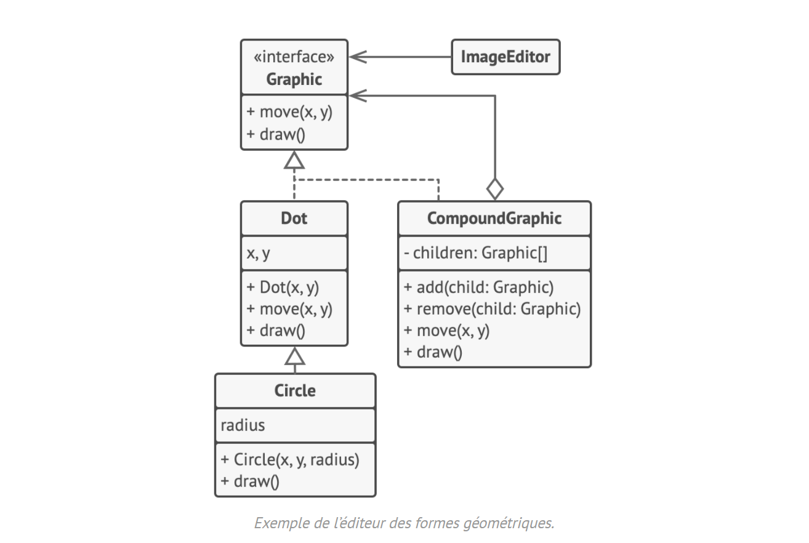

# Composite

## Intention

**Composite** est un patron de conception structurel qui permet d’agencer les objets dans des arborescences afin de
pouvoir traiter celles-ci comme des objets individuels.

## Structure

## Structure particulière

Dans cet exemple, le patron de conception **Composite** nous permet de gérer des imbrications de formes géométriques
dans un éditeur graphique.

