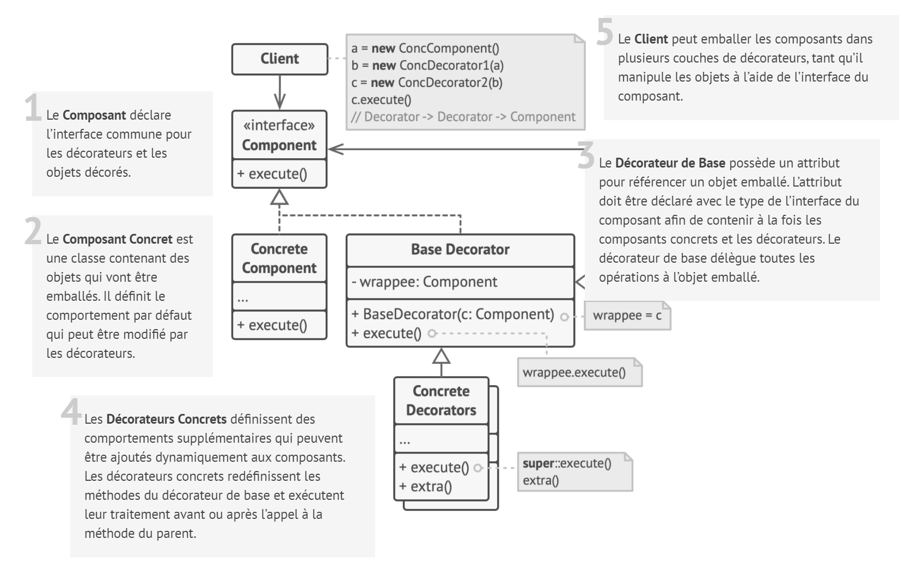
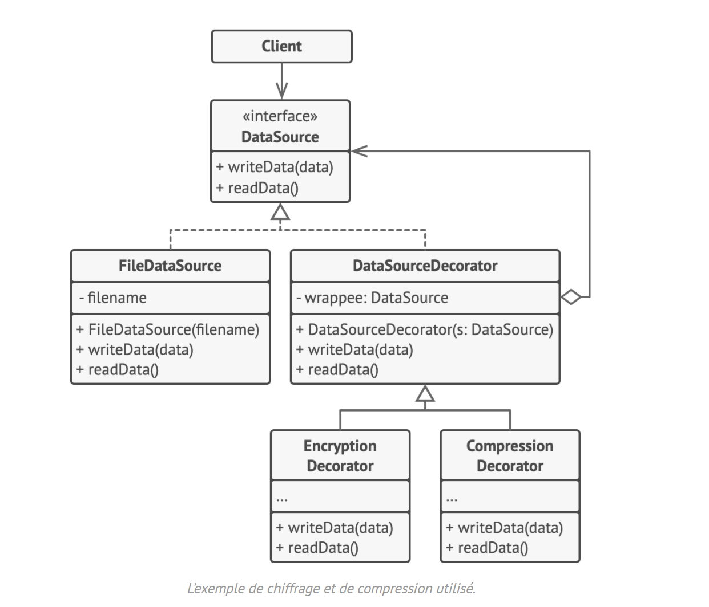

# Décorateur

## Intention

**Décorateur** est un patron de conception structurel qui permet d’affecter dynamiquement de nouveaux comportements à
des objets en les plaçant dans des emballeurs qui implémentent ces comportements.

## Structure

## Structure particulière

Dans cet exemple, le **Décorateur** permet la compression et le chiffrage des données indépendamment du code qui les
utilise.

