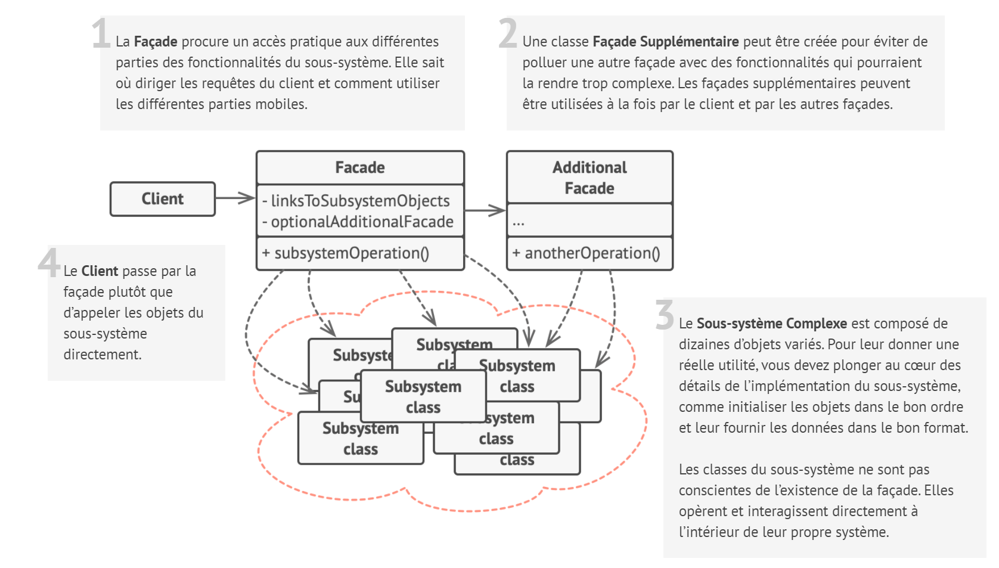
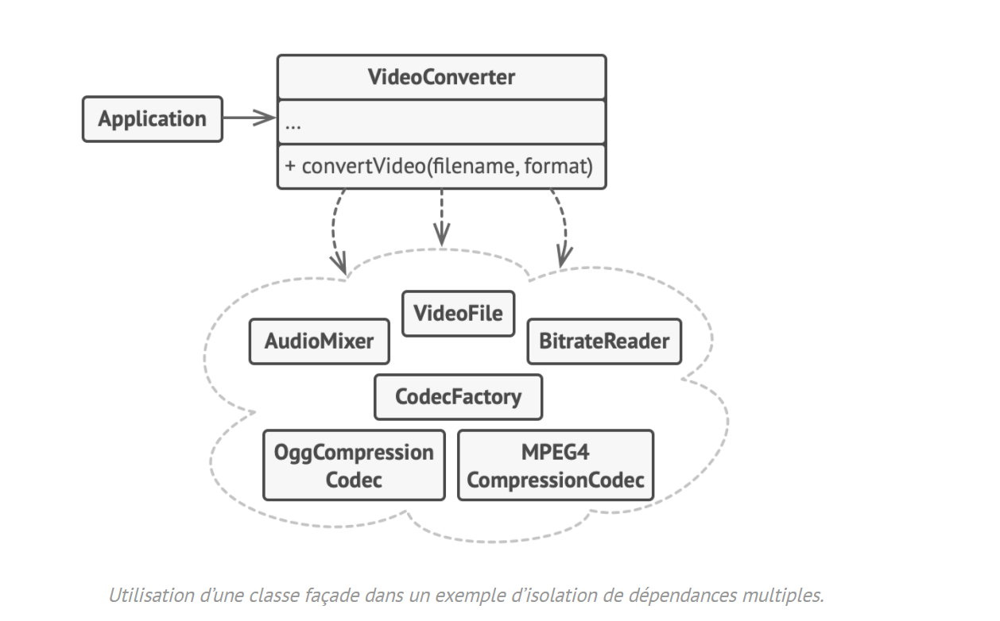

# Façade

## Intention

**Façade** est un patron de conception structurel qui procure une interface offrant un accès simplifié à une librairie,
un framework ou à n’importe quel ensemble complexe de classes.

## Structure

## Structure particulière

Dans cet exemple, le **Décorateur** permet la compression et le chiffrage des données indépendamment du code qui les
utilise.

