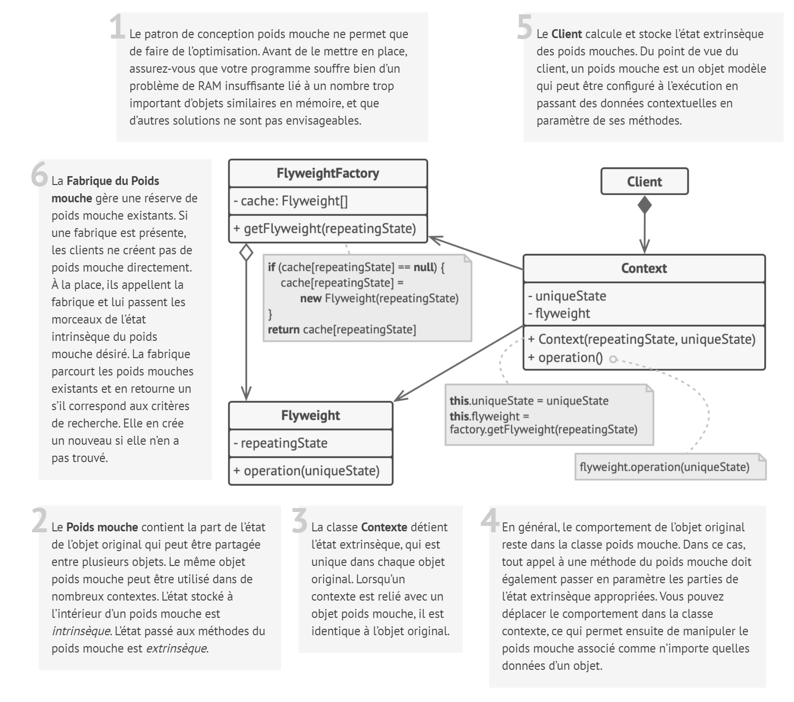
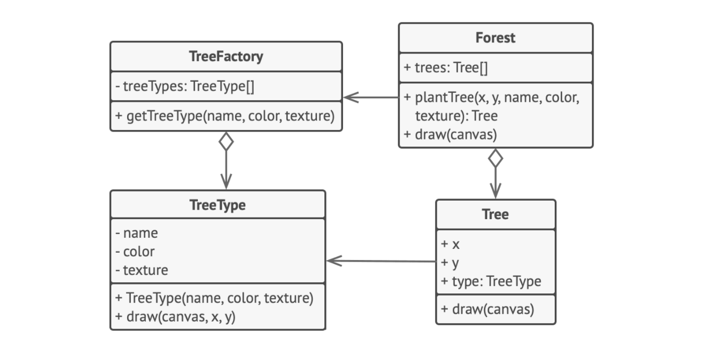

# Poids mouche

## Intention

**Poids mouche** est un patron de conception structurel qui permet de stocker plus d’objets dans la RAM en partageant
les états similaires entre de multiples objets, plutôt que de stocker les données dans chaque objet.

## Structure

## Structure particulière

Dans l’exemple suivant, le **Poids mouche** diminue l’utilisation de la mémoire lorsqu’il affiche les millions d’arbres
d’un canevas.

