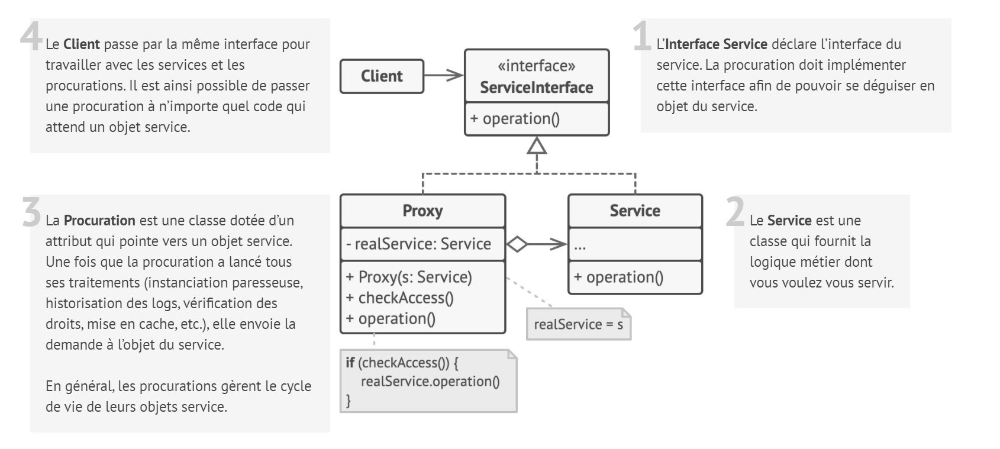
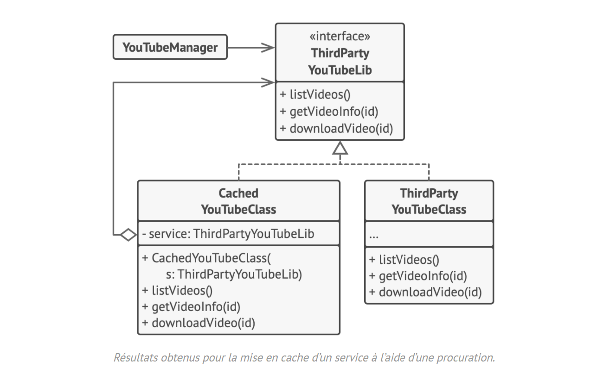

# Procuration

## Intention

La **Procuration** est un patron de conception structurel qui vous permet d’utiliser un substitut pour un objet. Elle
donne le contrôle sur l’objet original, vous permettant d’effectuer des manipulations avant ou après que la demande ne
lui parvienne.

## Structure

## Structure particulière

L’exemple suivant montre comment le patron de conception **Procuration** nous aide à utiliser l’instanciation paresseuse
et la mise en cache pour intégrer une librairie YouTube externe.

